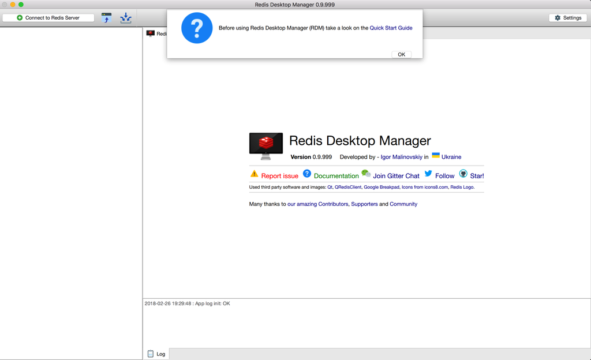

> 原文出处：https://www.shaobin.wang/post/1.html

### Mac OS X下编译安装
> 编译过程中在本机需要安装Xcode和Homebrew，如果没有安装，请自行搜索，下述过程是在已经安装了Xcode和Homebrew的基础上进行的。

##### 安装Qt
- 下载Qt安装包

  进入[Qt安装包下载地址](http://download.qt.io/official_releases/qt/)，选择对应版本进行下载，我这里选择版本5.10.1，安装包大概2.5G，需要耐心等待

- 安装Qt5.10.1

  打开DMG(qt-opensource-mac-x64-5.10.1.dmg)安装包，然后双击安装包中的app(qt-opensource-mac-x64-5.10.1.app)文件进行安装，安装时需要Qt账号密码，需要用邮箱注册一个，可以在软件安装页面注册，也可以通过Qt账号注册网页注册，网页注册地址：[注册Qt账号](https://login.qt.io/register)，登录之后就进入选取安装组件的页面

- 选择安装Qt时所需组件：

  组件选择分为两项： Tools全选 Qt 5.10.1中除Android x86、Android ARMv7、iOS这三项之外，其它全选 选择完成之后，点击继续进行安装

##### 编译rdm源码
①. 通过git仓库下载源码
```sh
 redis
cd /root/ && git clone --recursive https://github.com/uglide/RedisDesktopManager.git -b 0.9 rdm && cd ./rdm
```
②. 编译源码
```sh
cd ./src && ./configure
```
③. 添加plist文件

  打开文件夹 cd /root/rdm/src/resources ，找到 Info.plist.sample 文件，改名为 Info.plist

④. 打开rdm项目

  启动Qt Creator，选择打开项目，选择 /root/rdm/src/rdm.pro 文件

⑤. 修改rdm项目代码
```
#修改 rdm.pro 文件，在rdm.pro文件中找到第76行，由原来的
debug: CONFIG-=app_bundle
#改为以下内容
debug: CONFIG-=debug
```
⑥. 修改rdm项目设置

  如下图所示，选择左侧的项目按钮(数字1标识)，点击Build(数字2标识)，选择Release(数字3标识)，等待三角箭头从灰色变成绿色(数字4标识)，点击绿色三角箭头(数字4标识)：

  

⑦. 添加“crashreporter”

  在第上⑥步点击绿色三角箭头(Run)之后会出现错误，错误提示：
  ```
  make: *** No rule to make target `../bin/osx/release/crashreporter', needed by `../bin/osx/release/rdm.app/Contents/MacOS/crashreporter'.  Stop.
  ```
  因为没有添加crashreporter，添加步骤：

##### 下载“crashreporter”
[云盘分享](https://pan.shaobin.wang/f/7bb89d066d2e453fa806/)  云盘提取码：BmXDWHh2
##### 将“crashreporter”放到指定目录：
将crashreporter放到目录 /root/rdm/bin/osx/release/ 下

⑧. 重新运行rdm项目

    详细操作步骤见第⑥步

##### 安装并使用rdm
成功编译并运行后会默认打开rdm.app，这样就会看到熟悉的rdm管理界面了，退出rdm，打开安装包位置:
```sh
/root/rdm/bin/osx/release
```
在安装包文件夹中找到 rdm.app ，移动至 应用程序 文件夹，即可像使用其他应用程序一样使用rdm了，打开之后就会看到如下界面，当前官方最新版0.9.999

